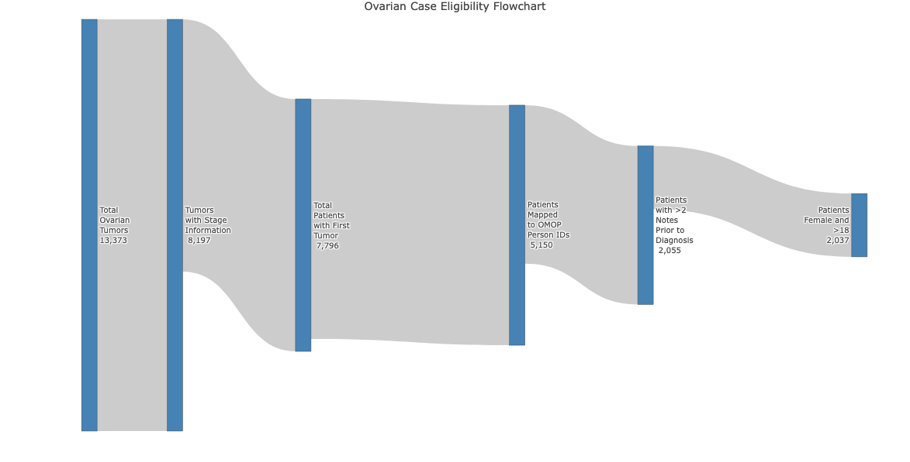
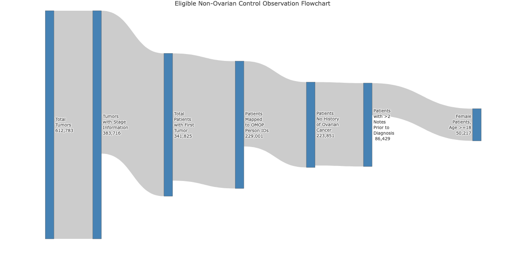
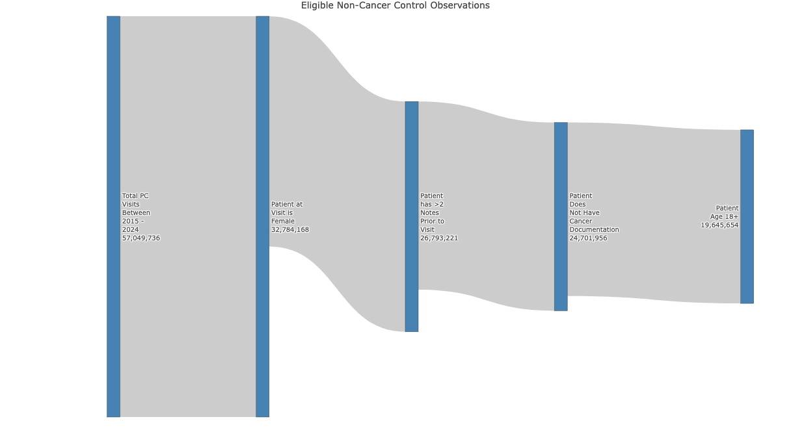

# Data

### Data Sources

All data ingested for this project came from Providence St. Joseph's Clinical and Tumor Registry Databases. This collection of databases consists of many nested schema and tables, with various person identification variables between different source databases. This data is a collection of patient care data within Providence's medical system, including tumor registry, tumor stage grading, patient demographic, clinical encounters, clinical notes and clinical diagnosis data. Each data source is briefly described below:

#### Tumor Registry

This source data consists of all documented tumors assessed at Providence. Observations are uniquely identified with the field \[CANCER_TUMOR_KEY\] and connected to other patient data using the \[PATIENT_KEY\] field. Only tumors analyzed and determined malignant, or cancerous, were included. Tumors were then separated into ovarian and non-ovarian tumors for case and cancer control group ascertainment, as later described, using clinical ontology codes (ICD-C).

#### Tumor Stage Grading

This source data consists of all documented stages given by clinicians, applied to unique tumors. This analysis required tumors to have a documented stage to be included. Given an individual tumor, represented by a unique \[CANCER_TUMOR_KEY\] can have more than 1 stage estimation documented, representing differing clinical opinions. When multiple stage estimates were present for a given tumor, 1 stage per tumor was selected by first prioritizing pathology assessments, then clinical then other assessment types. If there were ties within the assessment type, the most recent staging methodology year was selected, then most recent date of staging determination. 

#### Patient Demographics

This source data provided patient-level demographic variables, such as: race, ethnicity, date of birth and address. This data, exists in a different schema from the cancer data. Patients were only eligible for selection to cases or controls, if they had demographics data available. This ensured they were receiving care at Providence and had appropriate availability to be matched to cases.

#### Clinical Encounters

This source data is organized with the same patient variables as the person demographics. This data consists of clinical health encounters, or visits, documented in a patient's EHR. 

#### Clinical Notes

This source data is organized with the same patient variables as the person demographics. This data consists of all free-text note fields in a patient's EHR, organized by person and date and is organized in long-format, with many observations per unique person.

### Data Processing

#### Case & Control Ascertainment

The final analytic sample consists of persons from **one** case group and **two** control groups. 

Descriptions of how each group was derived are detailed below:

##### Case Group: Ovarian Cancer Cases

Case events consisted of the first malignant tumor with an ICD-C code indicating the tumor was ovarian cancer, where stage information is reported for the tumor evaluation. Persons were considered eligible for case events if they had general electronic health record data in the medical system, along with tumor data, were documented as "Female", at least 18 years old at the time of diagnosis and had a minimum of 2 clinical notes documented prior to the diagnosis date. The **index date**, or date of studied event to anchor time-series analysis on, for this group is considered the date of first eligible tumor diagnosis. 

##### Control Group 1: Similar Cancer Events, Other than Ovarian

The first control group, non-ovarian cancer controls, consisted of the first malignant tumor where stage information is reported for the tumor evaluation. Persons were considered eligible for controls if they had general electronic health record data in the medical system, along with tumor data, were documented as "Female", at least 18 years old at the time of diagnosis, had a minimum of 2 clinical notes documented prior to the diagnosis date and no documented history of Ovarian cancer. The index date for this group is considered the date of first eligible tumor diagnosis. 

Eligible non-ovarian cancer controls were matched to cases - using a 3-1 ratio and two step process:

**Step 1** Propensity scores were calculated using logistic regression of all case and eligible controls matching features:

+ Age at diagnosis
+ Race
+ Ethnicity
+ Year of diagnosis
+ Number of clinical notes prior to diagnosis
+ Stage of tumor at initial diagnosis

**Step 2** Controls were matched using a K-nearest neighbor machine learning classification model, where k was 3 matches, to select the best matches per case. Restrictions were added to the machine learning model so each control could only be matched up to 1 case/time.

##### Control Group 2: Non-cancer controls

The second control group, non-cancer controls, contains similar patients to the case group, with no cancer documentation.

Non-cancer controls were eligible to be matched if they had a primary care visits, with at least 2 clinical notes documented prior to the visit date. Persons were considered eligible for case events if they had general electronic health record data in the medical system, were documented as "Female", at least 18 years old at the time of diagnosis and had no documented prior history of cancer. The index date for this group is considered the date of primary care visit. For this control group, matching was event based, because one person could have multiple candidate index events to be matched to a case. 

Eligible non-cancer controls were then matched to cases using a 5-1 ratio and two step process:

**Step 1** Propensity scores were calculated using logistic regression of all case and eligible controls matching features:

+ Age at diagnosis
+ Race
+ Ethnicity
+ Year of index event
+ Number of clinical notes prior to index event

**Step 2** Controls were matched using a K-nearest neighbor machine learning classification model, where k was 5 matches, to select the best matches per case. Restrictions were added to the machine learning model so each unique person in the candidate control events could only be matched up to 1 case/time. 

### Data Organization

All data sources described above have been filtered from the source database to include only observations pertaining to a case or control person selected for analysis. Data was then normalized to meet third normal form and align best with analytic expectations. An entity-relationship diagram of the final data model can be found in **Appendix B**. 

