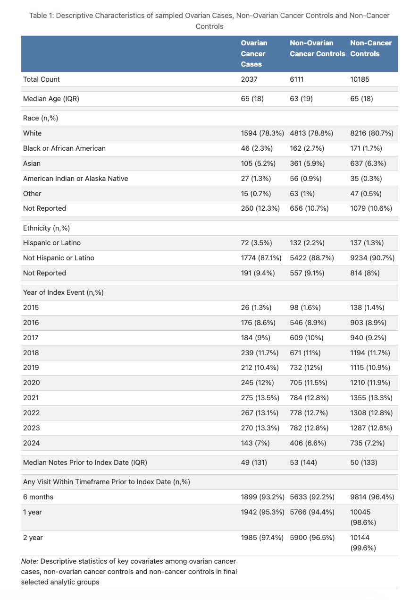

# Methodology

### Description of Case & Control Groups

In order to appropriately assess subsequent model results, the case and each control group needed to be described using a series of uni-variate statistics, dis-aggregated by group. Key differences in variables used for control-group propensity matching were assessed to confirm matching was conducted effectively. Other clinical covariates were also described between groups to understand differences in risk-factors for ovarian cancer diagnosis among case and control groups. 

### A Note on Clinical Notes

The primary goal of this analysis is the application of unstructured text data, stored as distinct, various clinical notes in a patient's EHR data, in a prediction model. In order to use these text data, they must be transformed into a vectorized or embedded formats to be analyzed for prediction. Each method for transformation and analysis of text data has benefits and trade-offs and to demonstrate this, two different approaches will be explored. 

**Method 1** consists of vectorizing common phrases and comparing frequency counts. While this method is the least complex and most noisy, conclusions drawn from this would be directly meaningful in clinical practice adjustments for risk assessment because the features analyzed retain much of their original meaning. 

**Method 2** consists of embedding the clinical notes in a medical language specific encoder and using these embeddings in random forest models. This method allows for the most specificity in measuring similarity between notes but results would yield reduced understanding because features remain in embedded values that do not directly relate translate to plain language "symptoms" or "risk factors". 

### Comparative Method 1: Vectorization Counts

The first method used to assess differences in clinical documentation between ovarian cancer and control groups was text vectorization and frequency analysis. In this analysis, all **phrases** of 3-7 words were extracted and compared across all documents for frequency. Vectorization was conducted on notes occurring in the 1 year prior to the index event and were analyzed in 2 time periods: 0-6 months from the index date and 6-12 months from the index date. 

For each set of time, up to 10,000 of the most common phrases were extracted from the documents as counts per document. Common English words were ignored but vectorization tools did not have the capacity to skip over common terms from medical records, specifically. Phrases were extracted only if they were included in at least 5 notes within the time set. Phrases that appeared in greater than 95% of the documents were also ignored. 

#### Phrase Analysis

Phrase frequencies were aggregated as binary indicators at the person-level for each time period. Then, **group-specific** ratios were calculated for each phrase determining what proportion of persons' notes in each case or control group contained the phrase, during the given time ratio. For example a **group-specific** ratio of 0.25, indicates 25% of the case or control group had at least 1 note with a given phrase. Next, **group-comparative** ratios were calculated to determine relative differences in phrase frequency between ovarian cancer cases and non-ovarian cancer controls or between ovarian cancer cases and non-cancer controls. 

Preliminary Results of the phrase-based vector models revealed many of the commonly occurring phrases were uninformative, causing noise in interpretation. An initial systematic layer of filtering occurred, with the intent to filter out medication related information. This data does exist in structured portions of the medical record and is best suited to be analyzed as such. Please see **Appendix C** for list of filtered out ineligible sub strings.

A second layer of manual filtering occurred to find meaningful themes in the vectors, as shown in the results section. Although not ideal, manual review was required to find themes in the an attempt to explore this very generalizable method for analysis. The top informative phrases were grouped into **clusters**. 

#### Cluster Analysis

Resulting from phrase-analysis were the following **clustered themes** indicating phrases with adjacent constructs:

| Clustered Theme | Phrases contain indication of: |
| :--- | :------------: |
| Standing | sitting or standing discussion |
| Cardiac | possible cardiac events |
| Smoking | smoking status or use quantity |
| Divorce | divorce or marital strain |
| Swelling | possible swelling events |
| Nausea | discussion of nausea event or treatment |
| Mouth | reference to mouth or throat |
| Airway | reference to airway components |
| Breathing | reference to breathing constraints |
| Chronic Pain | possible chronic pain history or events |
| Food Insecurity | discussion of food insecurity |
| Mental Health | possible mental health strain in history or events |
| Covid | discussion of Covid-19 |
| Breast Cancer | possible risk or discussion of breast cancer |

Please see **Appendix D** for which search terms were applied to phrases to cluster into the themes above. 

### Comparative Method 2: Embedding and Random Forest Classifier

To transform clinical notes data into embeddings they were analyzed using a medical-specific encoder-only text embedding model from SciSpacy. These embeddings yielded a 200-dimension vector for each observation. These vectors were explored in their full expression, as well as reduced. Two level of dimension reduction were applied. First, principle component analysis (PCA) was applied to create a 10-dimension set of features. Then Uniform Manifold Approximation and Projection (UMAP) was applied to the PCA features to reduce features to 2-dimensions. 

#### Random Forest Models

Random forest models included relevant time-frames and dimension-levels, as described below. In addition, all models included a feature indicating how close to the index date the observation was. Training and testing data was split using an 80%/20% divide using a stratified group approach. Strata were grouped along unique persons, so that all of an individual's clinical notes were either in the training or testing data sets. Each train/test split was assessed for similarity based on inclusion of time-frames prior to index date and outcome variable. Models weighted 5-1-1 towards the ovarian cancer group to optimize towards the more-rare outcome of interest. 

#### Combinations of Time-frames and Vector Dimensions

Multiple combinations of time-period inclusion and vector dimension were analyzed to see if predictive capacity could be improved by adjusting either. The following two time frames were explored - all notes and only notes occurring in the 2 years prior to the index. The following two vector dimensions were also explored - 200-dimension, non-reduced embedding and 10-dimension PCA reduced dimension. 

