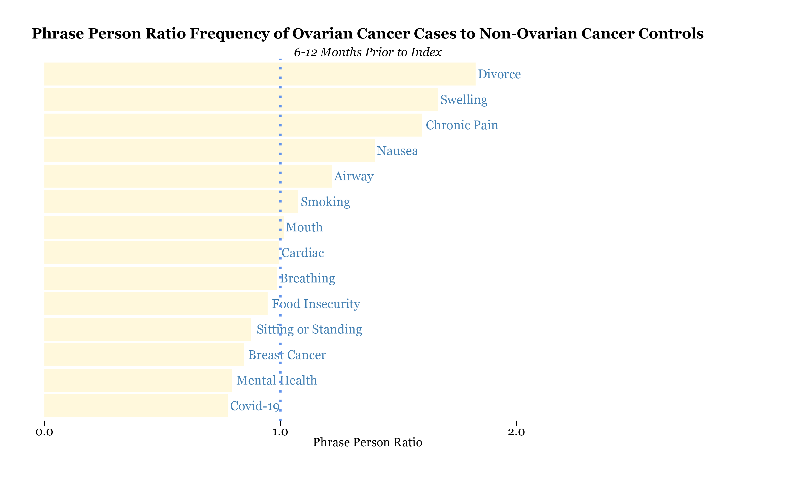
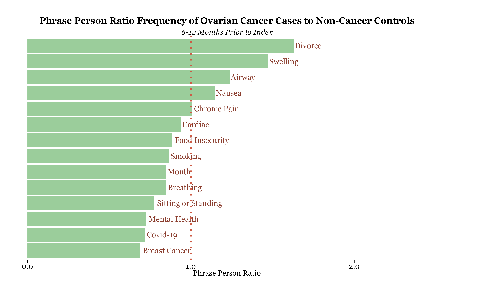
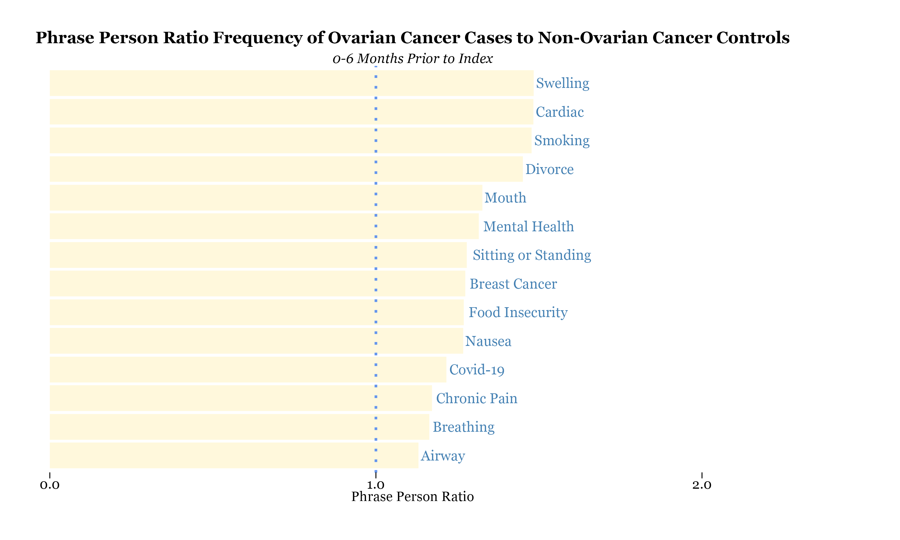
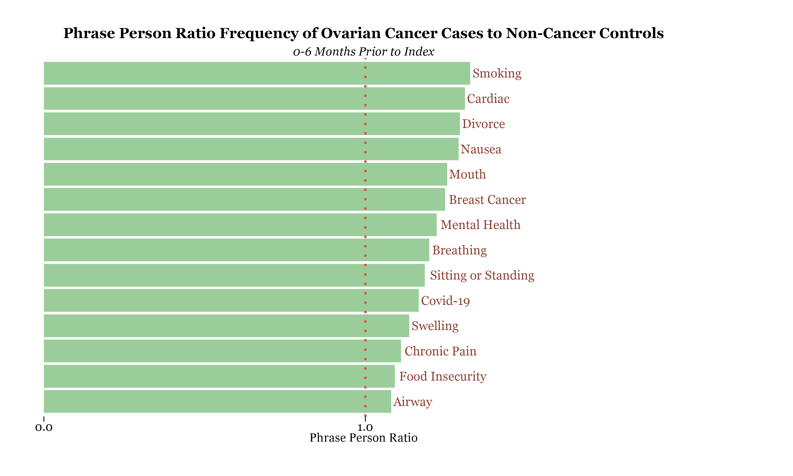
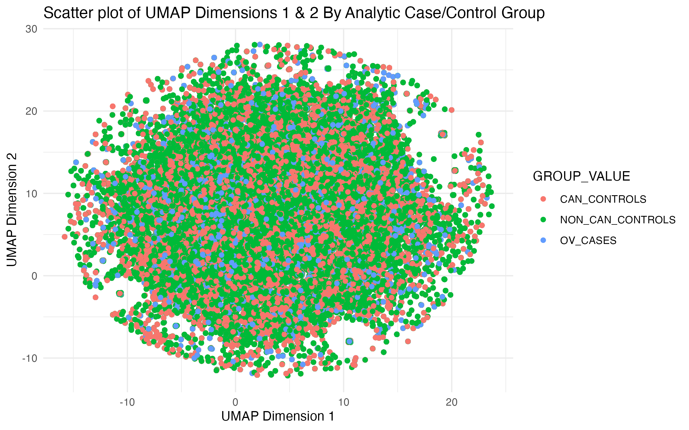

# Results

### Method 1 - Vectorization Models

Due to various levels of noise in phrase-based vectorization models, this report will focus on the cluster-based vectorization models. Please see **Appendix E** for visualizations of the top phrases in each time period for the phrase-based frequency analysis. 

#### 6-12 Months Prior to Diagnosis

In the 6-12 months prior to diagnosis, relative to non-ovarian cancer controls, the following phrase-person ratio's are observed among clustered themes. 

Most phrase ratios drop under 1, indicating the clustered themes are not appearing in persons with ovarian cancer more than individuals with other types of cancer. Notably, phrases referring to divorce, swelling, chronic pain, nausea, airway and smoking are observed more frequently in cases, relative to controls. 

Relative to non-cancer controls, the following phrase-person ratio's are observed among clustered themes. 

Similar themes emerge, with phrases referring to divorce, swelling, airway and nausea are observed more frequently in cases, relative to controls. 

#### 0-6 Months Prior to Index Date

Moving closer to the diagnosis date, in the 0-6 months prior to diagnosis, relative to non-ovarian cancer controls, the following phrase-person ratio's are observed among clustered themes. 

Phrase ratios across all clusters are greater than 1, indicating the clustered themes are appearing in persons with ovarian cancer more than individuals with other types of cancer. The highest phrase ratios observed are for phrases related to swelling, cardiac, smoking and divorce. 

Relative to non-cancer controls, the following phrase-person ratio's are observed among clustered themes. 

Similar themes emerge, with phrases referring to smoking, cardiac, divorce and nausea leading in frequently among cases, relative to controls. 

### Method 2 - Embedding of Clinical Notes and Random Forest Classifier

#### Notes Embedding

As described in the methodology section, 2 stages of dimension reduction on embedded notes values occurred.  Prior to use in a classifier model, embedded points in the reduced UMAP dimensions were plotted, but no obvious clustering of these values by group were observed:

#### Random Forest Classifier

The following table shows the results of the four random forest model classifiers assessed: 

**Table 2: Random Forest Model Results for 200- and 10-Dimension Models With and Without Time Restriction**

| Model Description | Group | Recall | Precision | F1-Score | Accuracy |
| :-----: | :-------: | :-----: | :---: | :---: | :---: |
| 200-Dimension Vector, All Time Points |  |  |  |  | 56% |
|  | Ovarian Cancer | 0.10 | 0.24 | 0.15 |  | 
|  | Non-Ovarian Cancer | 0.15 | 0.47 | 0.22 |  | 
|  | Non-Cancer | 0.89 | 0.59 | 0.71 |  | 
| 200-Dimension Vector, Only 2 years prior to Index Date |  |  |  |  | 59% |
|  | Ovarian Cancer | 0.12 | 0.27 | 0.17 |  | 
|  | Non-Ovarian Cancer | 0.09 | 0.46 | 0.14 |  | 
|  | Non-Cancer | 0.93 | 0.61 | 0.74 |  | 
| 10-Dimension Vector, All Time Points |  |  |  |  | 55% |
|  | Ovarian Cancer | 0.12 | 0.21 | 0.15 |  | 
|  | Non-Ovarian Cancer | 0.17 | 0.45 | 0.25 |  | 
|  | Non-Cancer | 0.86 | 0.59 | 0.70 |  | 
| 10-Dimension Vector, Only 2 years prior to Index Date |  |  |  |  | 58% |
|  | Ovarian Cancer | 0.13 | 0.22 | 0.17 |  | 
|  | Non-Ovarian Cancer | 0.07 | 0.44 | 0.12 |  | 
|  | Non-Cancer | 0.92 | 0.61 | 0.73 |  | 

Accuracy, ability of a model to appropriate categorize all observations to the correct group, for all random forest models ranges from 56-59%, meaning no model was able to correctly categorize all notes from either a case or control group more than 59% of the time. Precision, ability of a model to appropriately categorize observations for a specific group, differed for case and control groups. Each model's precision for correctly categorizing notes for ovarian cancer cases ranged from 0.21-0.24, meaning no model was able to correctly categorize notes from cases correctly more than 24% of the time. 

