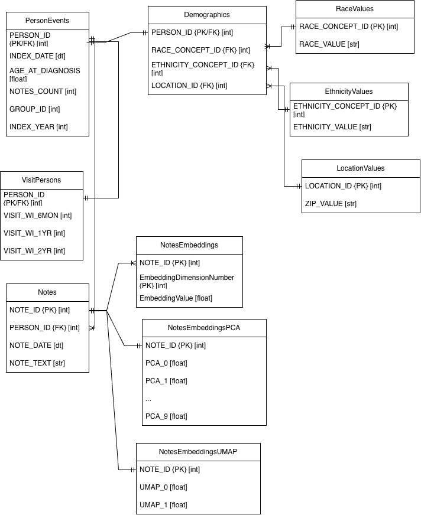
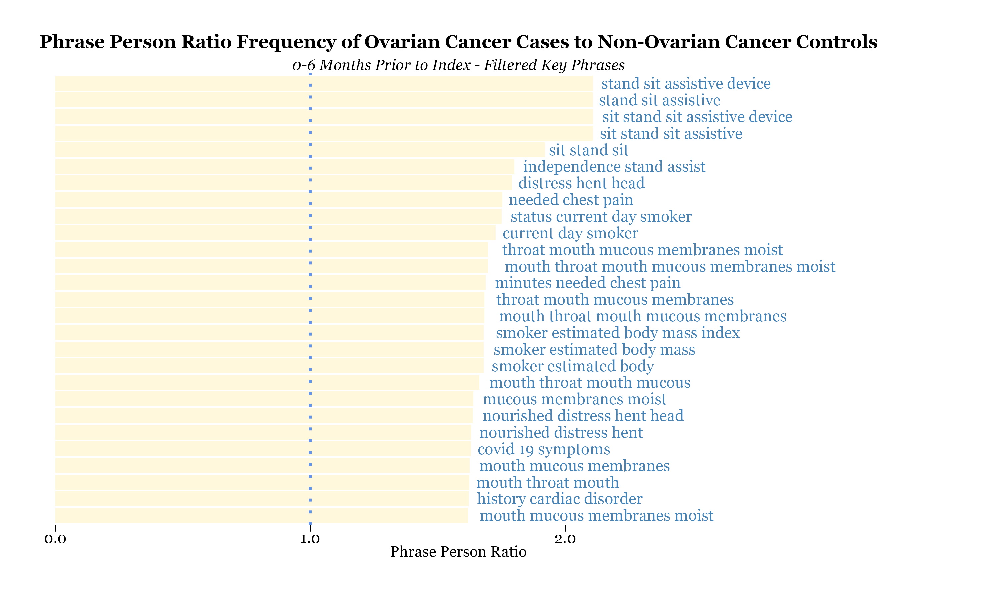
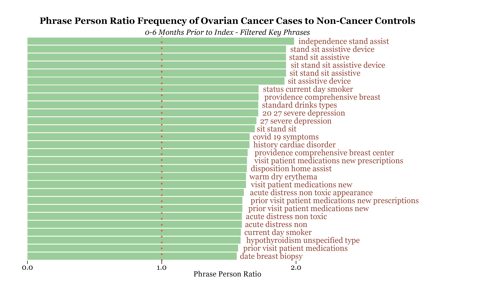
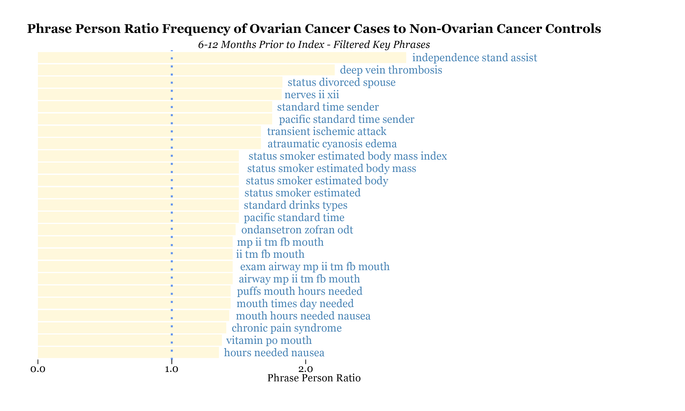
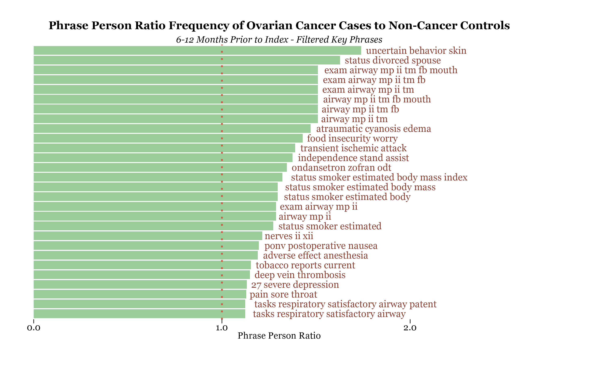

# Appendices

### Appendix A: Ovarian Cancer Stages

**Stage I**
In stage I diagnoses, cancer cells remain in one ovary, both ovaries or the fallopian tubes. Depending on the sub-stage, cancer cells may be found on the outer surface of affected organs and/or in fluid or washings from the abdomen and pelvis.

**Stage II**
In stage II diagnoses, cancer cells originate in one- , both ovaries or the fallopian tubes, and have spread to other organs within the abdomen. Cancer cells have not yet spread to nearby lymph nodes or distant sites. 

**Stage III**
In stage III diagnoses, cancer cells originate in one- , both ovaries or the fallopian tubes, and have spread to lymph nodes and/or nearby organs outside of the pelvis. Cancer cells have not yet spread to distant sites. 

**Stage IV**
In stage IV diagnoses, cancer cells originate in one- , both ovaries or the fallopian tubes and have spread to organs or tissues outside of the peritoneal cavity, distant lymph nodes, liver and/or spleen. 

### Appendix B: Entity Relationship Diagram of Final Data Model

### Appendix C: Filtered Out Substrings from Key Phrases

+ mg
+ ul
+ ml
+ mcg 
+ g
+ l
+ kg
+ mg/dl
+ mmol/l
+ mEq/L
+ mL/min
+ IU/L
+ units
+ labcorp
+ mmol

### Appendix D: Clustered Theme Search Terms in Phrases

| Cluster | Search Terms |
| :--- | :---: |
| Standing | stand; sit; |
| Cardiac | deep vein; ischemic; cardiac |
| Smoking | smok; cigarette; tobacco; pack year |
| Divorce | divorce; separated; marital |
| Swelling | edema; swelling |
| Nausea | nausea; vomit; zofran |
| Mouth | mouth; oral; tongue; throat |
| Airway | airway; trachea; larynx; bronchus |
| Breathing | breath; respiratory; dyspepsia |
| Chronic Pain | chronic pain; fibromyalgia; neuropathy; nerves |
| Food Insecurity | food insecurity; hunger; nutrition |
| Mental Health | mental health; depression; anxiety; psychiatric |
| Covid | covid; cornoavirus; sars-cov-2 |
| Breast Cancer | breast cancer; mammogram; mastectomy |

### Appendix E: Phrase-Based Vectorization Results

The following graph shows the top 20 phrases appearing in 0-6 months prior to the index date, when comparing the ovarian cancer observation proportion to the non-ovarian cancer proportion, after manual filter for phrases indicating clinical relevance from the top 100 phrases.

The following graph shows the top 20 phrases appearing in 0-6 months prior to the index date, when comparing the ovarian cancer observation proportion to the non-cancer proportion, after manual filter for phrases indicating clinical relevance from the top 100 phrases.

The following graph shows the top 20 phrases appearing in 6-12 months prior to the index date, when comparing the ovarian cancer observation proportion to the non-ovarian cancer proportion, after manual filter for phrases indicating clinical relevance from the top 100 phrases. 

The following graph shows the top 20 phrases appearing in 6-12 months prior to the index date, when comparing the ovarian cancer observation proportion to the non-cancer proportion, after manual filter for phrases indicating clinical relevance from the top 100 phrases.

